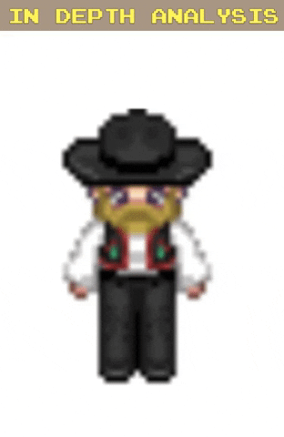

# spriteAnimation
A simple way to animate a sprite sheet with vanilla JS

Includes onmouseover and onmouseout events to animate sprite when cursor is on the sprite and stop when the cursor moves away.

